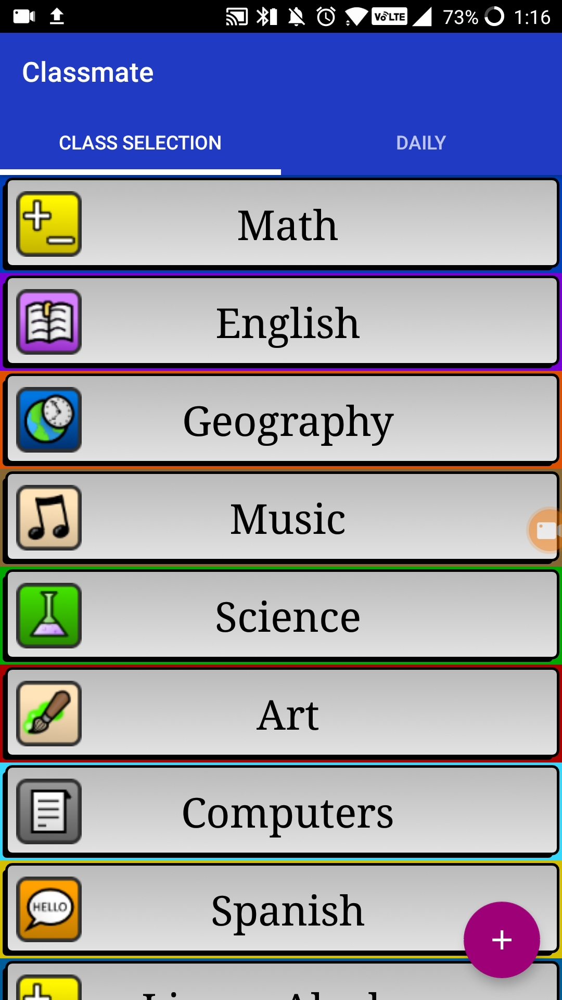
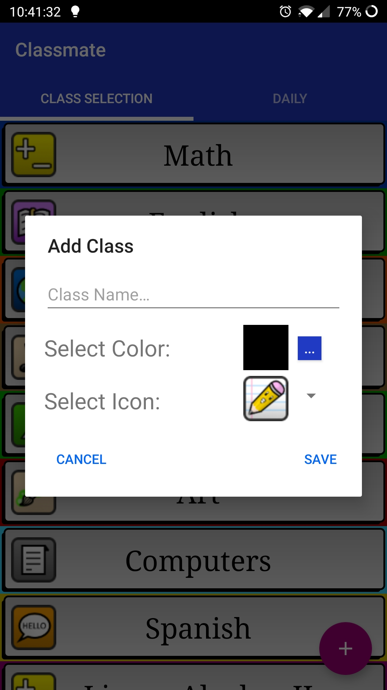
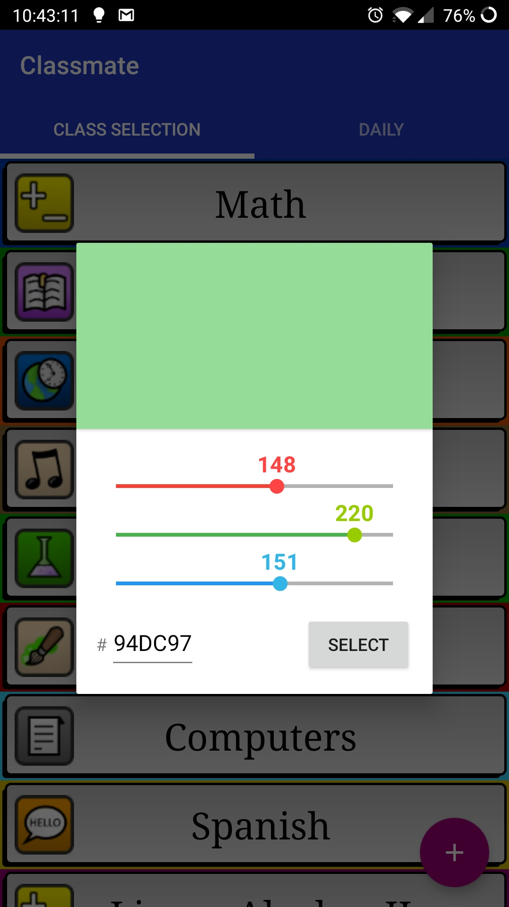
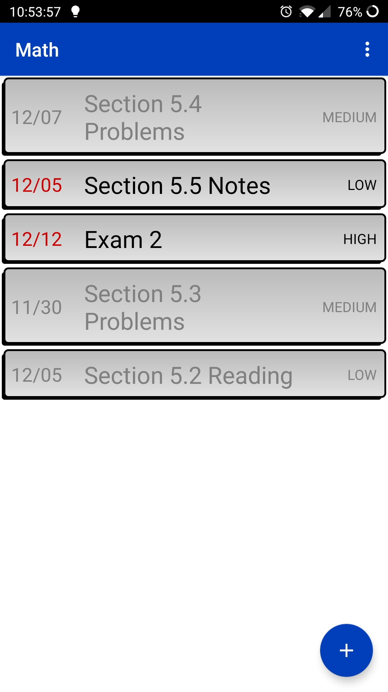
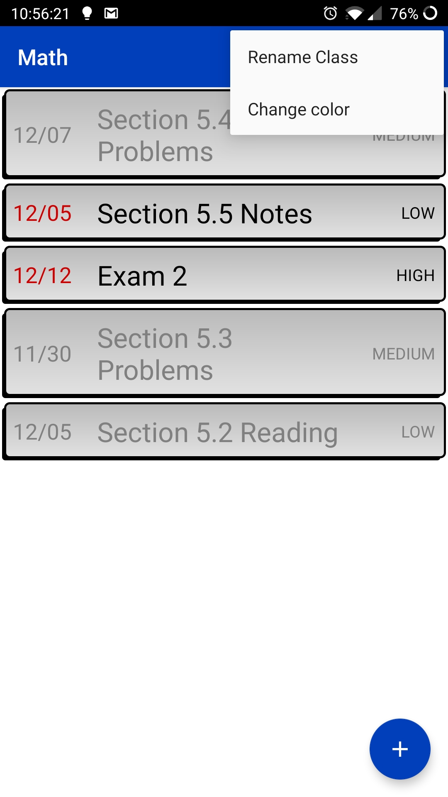
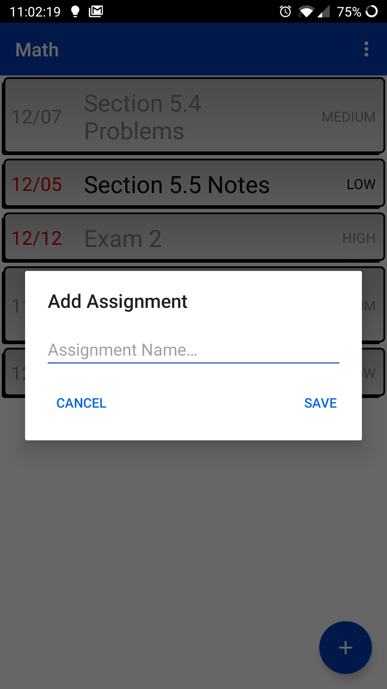
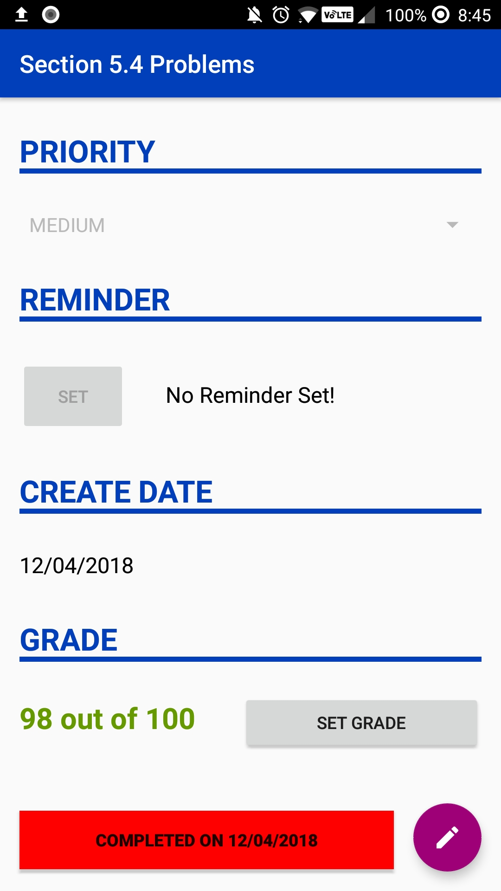
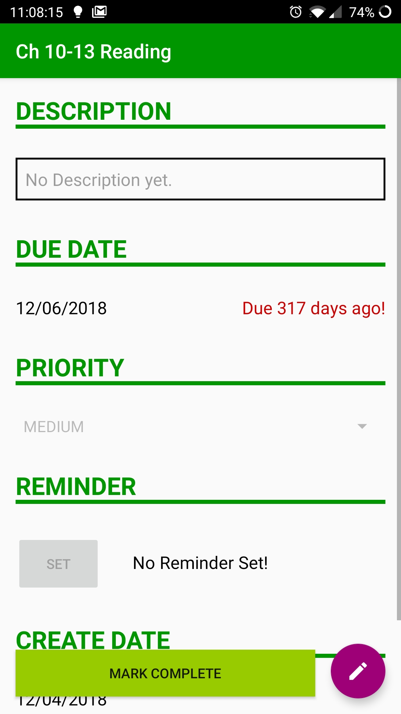
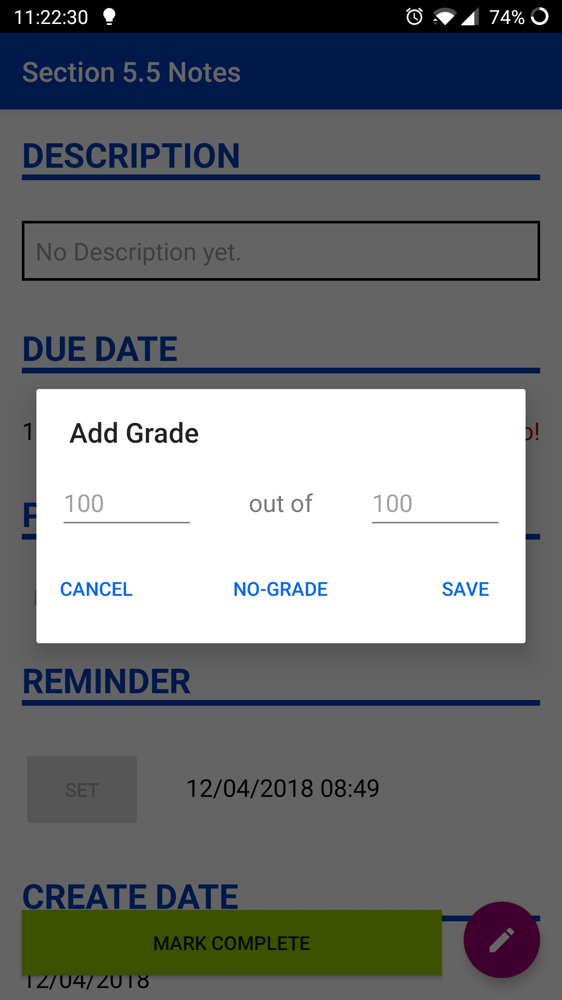
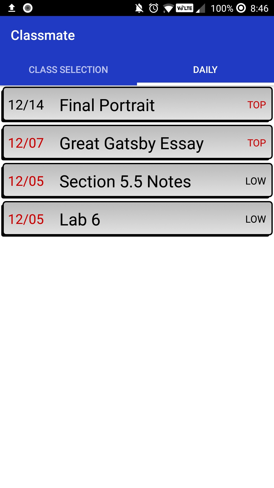

# Classmate

### What is Classmate?
Classmate is an android-only app that allows students to keep track of their school work. Students create a set of "Classes" that they select a Title, Color, and Icon for. Within each class the student adds individual assignments that they would like the app to track. Each assignment has information like title, description, priority, due date, create date, grade. When assignments change states(i.e. when they are late or completed) the UI is updated to reflect that status. There is also a special section called the Daily, that shows any assignments with TOP priority or those that are due tommorow.

### Screen Breakdown

#### Home Screen
On the home screen you can see all of the classes that this student has entered into the app listed. Each class is oulined by the color that the student selected for that specific class, ex. Math is blue and Geograpghy is orange. Each class also has its specific icon that the user chose next to it. Tapping on the plus button on the bottom will open a dialog for the student to add a new class. The other two screenshots show how simple it is to add a new class. Our color picker comes from [android-material-color-picker](https://github.com/Pes8/android-material-color-picker-dialog) which is under MIT license. From this screen the student can also swipe left to see the Daily Screen's list of assingments, more on that later.
  

####Class Screen
On this screen we see the list of the students assignments. Greyed out assignments have already been completed. In each assignment on the left we have the due date and on the right is the priority. Note that the colors of the bar and the add assignment button are blue here because this student chose blue as their class color, they could be any color. The class color and name can also be changed via the overflow menu on this screen. To delete an assignment the student only needs to hold it then select yes on the dialog. To add an assignment the student only needs to enter a name. This will lead the directly to the Assignment Detail Screen of their new assignment.
  

###Assignment Detail Screen
The assignment detail is the students way of tracking everything about that particular assignment. This screen has two different states, view and edit. In view mode none of the fields are editable so the student can quickly gaze over the information without worrying about activating the keyboard. To enter edit mode the student has to tap the edit button on the bottom right and then they can edit the various fields. The Due Date field tracks how much time until due or since due from today. There are 5 different priority options available: Low, Medium, High, Top. A top priority assignment will always be shown on the Daily Screen. The create date is not editable by the student. The Grade field does not appear until the student has marked an assignment as completed and can be skipped entirely with the NO-GRADE button. Grades from assignments are not used for any collective grade claculation anywhere, they are only a part of their assignment. A single reminder can be set for an assingment by picking the day and time of the reminder.
  

###Daily Screen
On the Daily Screen the student can see a view of the assignments they should have in their head for that day. It is a collection of assignments from ALL classes that are either due very soon or have top priority.

  
*App Developed by Owen McCormack and Jacob Phillips as part of Mobile App Development I. Icons Created by Juan Baez.*